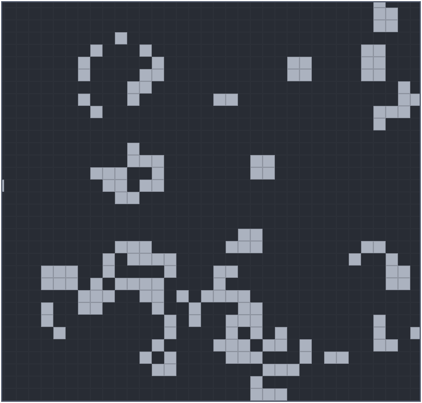
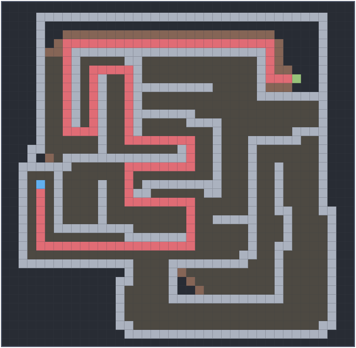
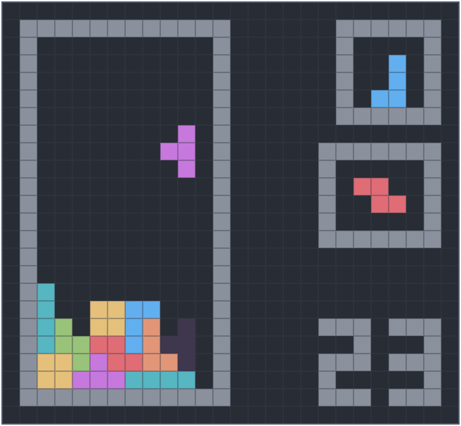

# PyGrid
An infinite, zoomable, pannable, resizable, multi-threaded grid written in python using pygame. Created as a resume project.

`pygrid.py` contains a PyGrid class that provides an interface for developing grid-orientated programs. Four programs have been created as demonstration: Conway's Game of Life, a pathfinding visualisation, Tetris, and Snake.

`draw_grid.py` extends the PyGrid class to add smooth drawing. `gameoflife.py` and `pathfinding.py` both use this.

#### Requirements
* Python 3.9+
* Pygame `python3 -m pip install pygame`

 

# Examples

## Game of Life
An implementation of Conway's Game of Life.

### Usage
* Run `gameoflife.py`.
* Draw cells with the left mouse, or erase them with the right mouse.
* Zoom with scroll wheel and pan the screen with the middle mouse.
* The speed of the simulation can be changed with keys 1-9.
* The algorithm can be changed with keys a, b, or c, where the algorithms are breadth-first, best-first and A* respectively.
* The simulation can be paused and resumed with space, or cleared entirely with escape.
* The grid can be cleared with delete.

 

## Pathfinding
Visualization of three pathfinding algorithms. `pathfinding.py`

### Usage
* Run `pathfinding.py`.
* Draw/erase a maze with the left mouse, then place two nodes using the right mouse. Press space to watch the algorithm find a path between the two.
* Zoom with scroll wheel and pan the screen with the middle mouse.
* The speed of the simulation can be changed with keys 1-9.
* The algorithm can be changed with keys a, b, or c, where the algorithms are breadth-first, best-first and A* respectively.
* The simulation can be paused and resumed with space.
* The simulation can be cancelled and cleared with escape.
* The entire grid can be cleared with delete.

 

## Tetris

### Usage
* Run `tetris.py`.
* Use WASD, arrow keys, or hjkl as movement controls.
* Press space to drop the current shape to the bottom.
* Press q to store the current shape.
* Press any key to restart after you die.

 

## Snake

### Usage
* Run `snake.py`.
* Use WASD, arrow keys, or hjkl as movement controls.
* Press any key to restart after you die.
